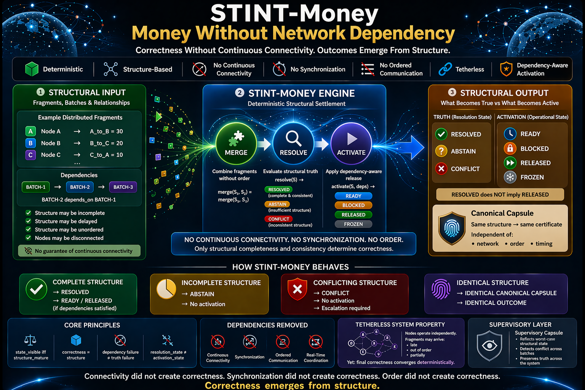

# ⭐ STINT-Money

**Money Without Network Dependency — Structural Settlement Reference Implementation**


[](https://github.com/OMPSHUNYAYA/STINT-Money/actions/workflows/stint-money-verify.yml)

**A deterministic proof that financial correctness does not require continuous connectivity.**

A minimal deterministic reference implementation where financial correctness is preserved and reconstructed directly from structure — not from continuous connectivity, synchronization, or ordered communication.

---

**Structure-Based Settlement • No Continuous Connectivity • No Synchronization • No Ordered Communication • Dependency-Aware Activation**

Financial correctness derived from structure — not from network continuity, message order, or synchronized exchange.

Built on **structure-first principles** from the Shunyaya framework.

---

## ⚡ **Try it in 30 seconds**

Run the reference demonstration:

```
python demo/stint_money_demo_v1.0.py
```

Run again:

```
python demo/stint_money_demo_v1.0.py
```

In under a minute, observe:

- deterministic structural settlement under delayed and unordered availability
- independent batch reconstruction
- dependency-aware activation
- separation of truth and activation
- tamper detection
- supervisory rollup under worst-case structural state

### **Expected demo outcome**

- `BATCH-1 -> RESOLVED + RELEASED`
- `BATCH-2 -> RESOLVED + READY / RELEASED when explicitly permitted`
- `BATCH-3 -> RESOLVED + BLOCKED`
- `BATCH-4 -> CONFLICT + BLOCKED`
- `Supervisory capsule -> worst-case structural view across batches`

---

## **STINT Theorem (Reference Claim)**

Given complete and consistent financial structure:

financial correctness is determined solely by structure, independent of continuous connectivity, synchronization, and ordered communication.

These affect only:

- when structure becomes available
- when activation is permitted

They do not determine financial truth.

---

## ⚡ **The One-Line Breakthrough**

A financial system can preserve correctness without continuous network connectivity.

No synchronized exchange. No ordered communication. No dependence on always-on transport.

Yet correctness holds — when structure is complete and consistent.

---

## 🔒 **Structural Guarantee**

STINT-Money preserves classical financial correctness.

For any valid structure `S`:

`classical_result(S) = STINT_result(S)`

The system does not change financial outcomes.

It enforces a stricter rule:

`invalid or incomplete structure -> no outcome`

This ensures:

- no forced correctness
- no approximation
- no hidden correction
- only structurally valid truth becomes visible

---

## 🧾 **Structural Lineage**

STINT-Money represents the next layer in structural financial correctness:

- `SLANG-Money -> removes execution dependency`
- `ORL-Money -> removes ordering dependency`
- `STINT-Money -> removes continuous network dependency`

It shows that:

money correctness does not require continuous connectivity.

### **Relation to Prior Work**

STINT-Money belongs to a broader structure-first financial lineage within the Shunyaya ecosystem.

- SLANG-Money demonstrates financial correctness without execution.
- ORL-Money demonstrates financial correctness without ordering.
- STINT-Money demonstrates financial correctness without continuous connectivity.

Together, they show a layered structural progression:

`execution -> ordering -> connectivity`

Each dependency is removed independently, while correctness remains preserved by structure.

Related structural references include SLANG-Money, ORL, ORL-Money, STOCRS, STIME, SSUM-Time, and the Shunyaya master documentation.

---

## 🧭 **Visual Overview**



---

## 🔗 **Quick Links**

### 📘 **Docs**

[Quickstart](docs/Quickstart.md)  
[FAQ](docs/FAQ.md)  
[Proof Sketch](docs/Proof-Sketch.md)  
[Reference Demonstration](docs/STINT-Money-Reference-Demonstration.md)  
[Architecture Notes](docs/STINT-Money-Architecture-Notes.md)  
[Pre-Settlement Structural Layer](docs/Pre-settlement-Structural-Layer-Note.md)  
[Structural Overview](docs/STINT-Money-Structural-Settlement.png)

### ⚙️ **Framework**

[Dependency Elimination Framework](docs/Dependency-Elimination-Framework.png)

### ⚡ **Demo**

[Python Reference Demonstration](demo/stint_money_demo_v1.0.py)

### 🔍 **Verification**

[Verify Instructions](VERIFY/VERIFY.txt)  
[Demo Hash Freeze](VERIFY/FREEZE_DEMO_SHA256.txt)

---

## 📂 **Repository**

[demo/](demo/) — deterministic reference demonstration  
[docs/](docs/) — explanation, proof, architecture, and usage  
[VERIFY/](VERIFY/) — reproducibility and verification

---

## 💡 **What This Reference Implementation Demonstrates**

This system proves one core claim:

financial correctness does not require continuous connectivity.

More broadly, it shows that correctness does not depend on:

- continuous connectivity
- synchronized communication
- ordered message exchange
- real-time coordination

Instead:

`correctness = structure`

---

## ⚖️ **What This Is / Is Not**

### **STINT-Money IS:**

- a structural settlement reference implementation
- a deterministic tetherless settlement demonstration
- a proof that continuous connectivity is not fundamental to correctness
- a structure-first financial correctness model

### **STINT-Money IS NOT:**

- a full financial system
- a payment engine
- a production settlement network
- a regulatory or compliance framework

It is the smallest visible proof of tetherless structural settlement.

---

## 📌 **Adoption Note**

STINT-Money can be introduced as a **pre-settlement structural correctness layer**.

It determines financial correctness before banking or network-dependent systems are involved.

→ [Read more: Pre-Settlement Structural Layer](docs/Pre-settlement-Structural-Layer-Note.md)

---

## 🔥 **The Core Structural Laws**

`state_visible iff structure_mature`

`dependency failure != truth failure`

`resolution_state != activation_state`

`same structural truth -> same canonical merged capsule`

---

## 🕳 **Absence Principle**

If structure is not complete, outcome does not exist.

`incomplete structure -> no outcome`  
`conflicting structure -> no valid outcome`

Outcome is not delayed.  
Outcome is absent until structure is sufficient.

---

## 🛡 **Structural Safety Model**

`insufficient structure -> ABSTAIN`  
`inconsistent structure -> CONFLICT`  
`dependency failure -> BLOCKED`  
`supervisory withholding -> FROZEN`  
`complete and consistent structure -> RESOLVED`

No guessing. No forcing. No unsafe activation.

### **No Forced Correctness Guarantee**

The system does not produce incorrect outcomes under missing, conflicting, or dependency-blocked conditions.

If structure is incomplete or inconsistent:

- no incorrect state is produced
- no unsafe activation is permitted

Only structurally valid states become visible.

Only dependency-satisfied states become activatable.

---

## 🧮 **Deterministic Guarantees**

**Determinism:**  
Same structure → same outcome

**Order Independence:**  
Merge order does not affect final truth

**Path Independence:**  
Merge path does not affect canonical outcome

**Truth / Activation Separation:**  
A batch may be RESOLVED but still BLOCKED

**Certificate Stability:**  
Equivalent structure produces reproducible certificate

---

## 🧬 **Collapse Guarantee**

All structural evaluation collapses to classical financial truth:

`phi((structure, activation, supervision)) = classical_result`

No matter how structure is merged, delayed, or reconstructed:

final observable outcome remains identical to classical correctness.

Structure does not change truth.  
It reveals it deterministically.

---

## 🔐 **Structural Certificate**

Each resolved structure produces a deterministic structural certificate:

`same structure -> same certificate`

The certificate is:

- reproducible
- verifiable
- independent of network continuity
- independent of merge order

This makes the final structure itself a form of proof.

**Note:**  
The structural certificate is derived from resolved structure, not from the file itself.  
Identical structure produces identical certificates, independent of representation.

---

## 📁 **Verification**

Deterministic outputs and reproducibility can be verified using:

`VERIFY/FREEZE_DEMO_SHA256.txt`  
`VERIFY/VERIFY.txt`

---

## 🧭 **The Scenario**

The demonstration includes multiple batches with different structural conditions:

- valid batches that resolve deterministically
- a dependency-aware batch that can be READY before explicit release
- a batch that remains RESOLVED but BLOCKED
- a conflicting batch that escalates supervisory state
- a frozen batch whose truth is preserved while activation is withheld

**Important:**  
The demo is not modeling transaction execution.  
It is modeling structural financial correctness under tetherless conditions.

---

## ⚙️ **Structural Settlement**

The system reconstructs and evaluates structure until stable:

`resolve(structure)`

Operational release is modeled separately:

`activate(structure, dependencies)`

This means:

- truth is structural
- activation is controlled

### **Three-Layer Structural Flow**

STINT-Money separates three roles that are often treated as one:

**Structural Truth**  
Financial correctness is determined only from complete and consistent structure.

**Dependency and Activation**  
Operational readiness depends on dependency satisfaction, release conditions, and supervisory policy.

**Optional Transport**  
Networks may carry, delay, replay, or deliver structure — but they do not create correctness.

This separation is the key architectural move in STINT-Money:

`structure -> truth`  
`dependencies -> activation`  
`transport -> optional carrier`

Transport affects availability.  
It does not create financial truth.

---

## 🔍 **What Changes When Structure Breaks**

If structure becomes inconsistent:

`resolve(S) -> CONFLICT`

If structure is insufficient:

`resolve(S) -> ABSTAIN`

If dependencies fail:

`activate(S) -> BLOCKED`

---

## 🧠 **Critical Insight**

The system does not produce failure by default.  
The system does not guess.  
The system does not approximate.

Instead:

- structure is evaluated conservatively
- truth is preserved structurally
- activation is withheld when unsafe

---

## 🔁 **Deterministic Convergence Proof**

Re-run the demo:

```
python demo/stint_money_demo_v1.0.py
```

Result:

- identical outputs
- identical certificates
- identical structural behavior

---

## 🔁 **Dependency-Aware Release**

The model explicitly distinguishes:

`READY -> structurally eligible`  
`RELEASED -> operationally applied`

This means a batch can be correct without being released.

---

## 🔁 **Supervisory Rollup**

Multiple batches combine into a supervisory view.

Result:

- resolved batches remain valid
- conflict escalates supervisory state
- blocked activation remains visible
- frozen batches preserve truth without release

---

## 🧠 **What This Means**

Financial correctness was preserved without:

- continuous connectivity
- synchronization
- ordered communication

This demonstrates a deeper principle:

structure determines truth  
transport only determines availability

---

## ⚡ **What This Challenges**

Traditional assumption:

`money correctness = connectivity + synchronization + order`

STINT-Money shows:

`money correctness = structure`

---

## 🧱 **Minimal Integration**

A minimal deployment path for STINT-Money is:

`input structure -> resolve -> canonical outcome -> activation control -> supervisory visibility`

This can be positioned as a pre-settlement structural layer:

`financial fragments -> structural resolution -> dependency-aware activation -> optional downstream settlement`

Only the structurally necessary outcome needs to cross the network boundary.

---

## 🧩 **Reference Implementation Surface**

Core mechanism:

- fragment merge
- structural resolution
- canonical convergence
- dependency-aware activation
- supervisory rollup
- tamper validation

**Minimal • Deterministic • Reproducible**

---

## 📊 **Comparison**

| Model        | Continuous Connectivity Required | Ordered Communication Required | Truth / Activation Separated | Canonical Structural Outcome | Deterministic |
|--------------|----------------------------------|--------------------------------|------------------------------|------------------------------|--------------|
| Traditional  | Yes                              | Yes                            | No                           | No                           | Conditional  |
| Eventual     | Yes                              | Often                          | Limited                      | Limited                      | Conditional  |
| Ledger-Based | Yes                              | Yes                            | Limited                      | Limited                      | Conditional  |
| STINT-Money  | No                               | No                             | Yes                          | Yes                          | Yes          |

---

## 🌍 **Implications**

If this scales:

- network becomes optional for correctness
- synchronization becomes non-fundamental
- settlement becomes structurally verifiable
- audit becomes capsule-based
- system recovery becomes deterministic

---

## 🧭 **Relationship to Other Structural Financial Layers**

**SLANG-Money:**  
single-node structural resolution  
correctness without execution

**ORL-Money:**  
multi-node structural reconciliation  
correctness without ordering

**STINT-Money:**  
tetherless structural settlement  
correctness without continuous connectivity

Together:

structure-first financial correctness across execution, ordering, and connectivity layers

---

## 🧱 **Dependency Elimination Framework**

| Domain | Removed Dependency | What Preserves Correctness |
|---|---|---|
| Time | clocks | structure |
| Decision | order | structure |
| Meaning | sequence | structure |
| Money | continuous connectivity | structure |
| Truth | agreement | structure |
| Computation | execution | structure |
| AI | inference | structure |
| Cybersecurity | process / pipelines | structure |
| Identity | authority / registry | structure |
| Consensus | voting / quorum | structure |
| Network | connectivity | structure |
| Cloud | cloud infrastructure | structure |
| Audit | verification | structure |

Each row removes a dependency — yet correctness remains intact.

Nothing is replaced.  
Nothing is approximated.  
Only the dependency is eliminated.

---

## 📜 **License**

See: [LICENSE](LICENSE)

**Reference Implementation:**  
Open Standard — free to use, study, implement, extend, and deploy

**Architecture and Documentation:**  
CC BY-NC 4.0

---

## 🔭 **Roadmap (Exploratory)**

This release focuses on minimal structural proof.

Planned explorations include:

- stronger dependency graphs
- multi-party settlement chains
- richer supervisory policy models
- cryptographic envelope and attestation layers
- partition recovery and replay models
- larger-scale tetherless settlement scenarios

These are extensions of the same principle:

`correctness = structure`

This release proves the principle in tetherless settlement. Extensions are exploratory.

---

## 🔗 **Related Structural References**

- [ORL](https://github.com/OMPSHUNYAYA/Orderless-Ledger) — ledger correctness from structure without ordering  
- [STOCRS](https://github.com/OMPSHUNYAYA/STOCRS) — computation from structure without execution  
- [STIME](https://github.com/OMPSHUNYAYA/Structural-Time) — time from valid structural transitions  
- [SSUM-Time](https://github.com/OMPSHUNYAYA/SSUM-Time) — structural clock for time reconstruction and recovery  
- [SLANG-Money](https://github.com/OMPSHUNYAYA/SLANG-Money) — financial state from structure without transactions  

---

## 🧭 **Final Statement**

Connectivity did not create correctness.  
Synchronization did not create correctness.  
Order did not create correctness.

**Correctness emerged from structure.**
